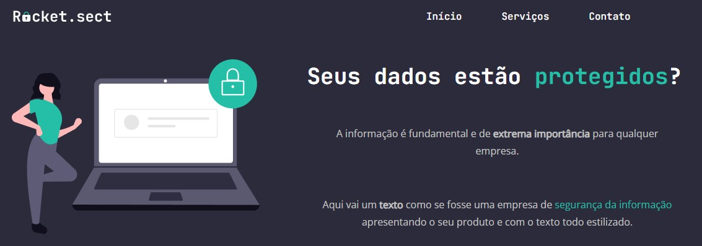

<h1 align="center">Desafio avançado - 
Recriando layout
</h1>

.

|
  <a href="#-tecnologias">Tecnologias</a> |
  <a href="#-desafio">Desafio</a> | 
  <a href="#-layout">Layout</a> | 
  <a href="#memo-licença">Licença</a> | 

  

 

  

  

## 📖 Tecnologias

Esse projeto foi desenvolvido com  as seguintes tecnologias:

- HTML e CSS3
- GIT e GITHUB
- FIGMA

## 💻 Desafio

O desafio proposto foi, recriar o layout proposto no projeto Figma para treinar os posicionamentos dos elementos, espaçamentos

## 📐 Layout

Você pode visualizar o layout do projeto através [DESSE LINK](https://www.figma.com/file/sSpOrM1s4asZlBIoLKLIVh/Explorer-(Copy)?type=design&node-id=16-106&mode=design&t=KD9ZJlwtpKD2JWQl-0). É necessário ter conta no [Figma](https://figma.com) para acessá-lo.

## :memo: Licença

Esse projeto está sob a licença MIT.

---

Feito com ❤ by Rocketseat :wave: [Participe da nossa comunidade!](https://discord.gg/rocketseat)